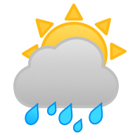
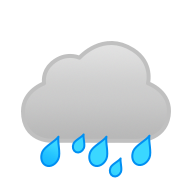

# OpenWeatherImages

**OpenWeatherImages** is a **Swift Package** that provies images associated with OpenWeatherAPI's [weather](https://openweathermap.org/weather-conditions) object.

## Sample Images





Usage:
```swift
// Lookup using string name
let imageName = "01d"
let image = OpenWeatherImages.getImage(name: imageName)
```

```swift
/// Lookup using enum
let image = OpenWeatherImages.getImage(type: ._01d)
```